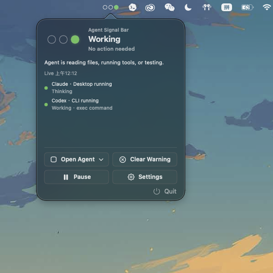
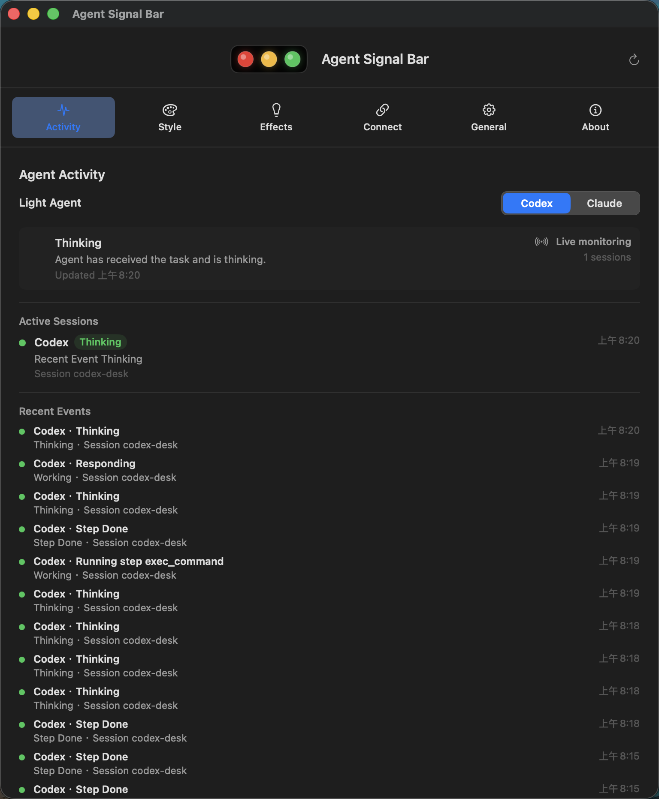
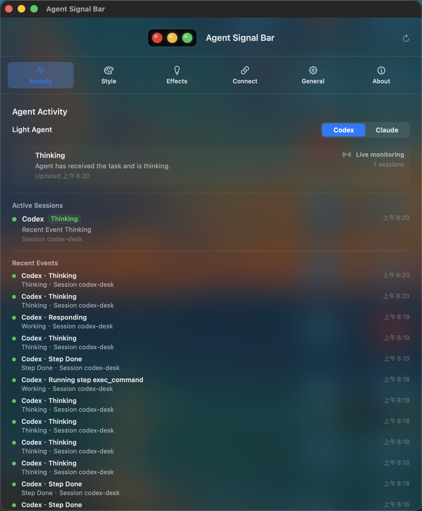
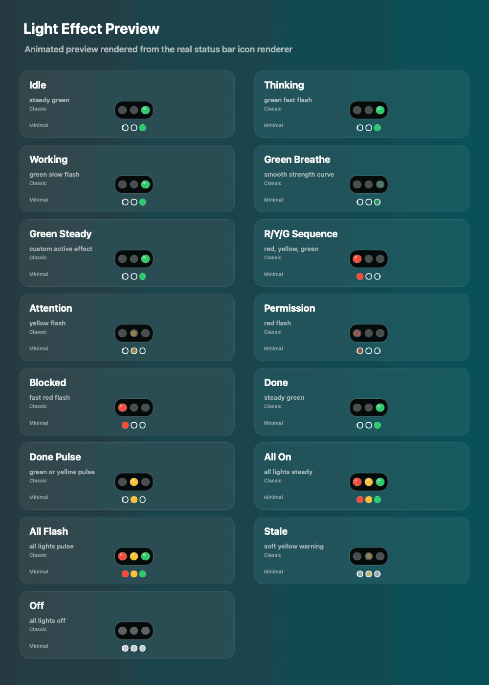

# Agent Signal Bar

[English](README.md) | [简体中文](README.zh-CN.md)

<p align="center">
  
</p>

<p align="center">
  <strong>Local status lights for AI agents on macOS.</strong>
</p>

<p align="center">
  Customizable light effects · Multilingual UI · Local-first · Codex and Claude Code hooks
</p>

<p align="center">
  
</p>

<p align="center">
  <em>Animated effect preview rendered from the real status bar icon renderer, configured with the red/yellow/green sequence effect.</em>
</p>

Agent Signal Bar is a local-first macOS menu bar app that uses three red, yellow, and green signal lights to show the current state of local AI agents. It helps you see whether Codex, Claude Code, or a local script is idle, working, done, waiting for approval, or blocked without switching back to a terminal or editor.

## Download And Open

For normal use, download the app from [GitHub Releases](https://github.com/guan-ops/Agent-Signal-Bar/releases/latest), not from the green `Code` button. The `Code > Download ZIP` file is source code and does not contain a ready-to-open app installer.

1. Open the [latest release](https://github.com/guan-ops/Agent-Signal-Bar/releases/latest).
2. Download `AgentSignalLight-local.dmg`.
3. Open the DMG and drag `AgentSignalLight.app` to `Applications`.
4. Open Agent Signal Bar from `Applications`.

If macOS blocks the first launch because the build is not notarized yet, right-click the app and choose `Open`, or use `System Settings > Privacy & Security > Open Anyway`.

Developers can also download the source code and run `./script/build_and_run.sh`.

## Menu Bar Panel

<p align="center">
  
</p>

Click the menu bar signal light to open a compact panel with the current status, running agents, the latest event, and quick actions for opening agents, clearing alerts, pausing monitoring, opening settings, and quitting.

## Settings Glass Comparison

<table>
  <tr>
    <td align="center"><strong>Without Glass</strong></td>
    <td align="center"><strong>Standard Glass</strong></td>
  </tr>
  <tr>
    <td></td>
    <td></td>
  </tr>
</table>

Both images are real screen-region screenshots of the Activity page. The left image shows the normal solid settings window, while the right image shows the standard glass style with the desktop background participating in the window material. The glass settings can be changed in `General > Settings glass`.

## Features

- macOS menu bar signal light with horizontal and vertical layouts.
- Two visual styles: classic signal board and minimal dots.
- Menu bar panel with current status, running agents, latest event, quick actions, and quit.
- Settings window with Activity, Style, Effects, Connections, General, and About pages.
- Codex Desktop activity monitoring, Codex hooks, Claude Code hooks, and generic JSON event input.
- Multi-session aggregation so permission, failure, and blocked states are not overwritten by normal working states.
- Local CLI for scripts, automation, and custom agents.
- Multilingual UI with system-language detection and manual language switching.
- Customizable light effects, including blink speed, breathing strength, and per-state effect choices.
- Theme selection, launch at login, and effect testing.
- No cloud service is required. State files, hooks, and diagnostics stay on your Mac.

## Signal Language

| Agent state | Default effect | Meaning |
| --- | --- | --- |
| Idle `idle` | steady green | Nothing needs attention |
| Thinking `thinking` | fast green flash | The agent is reasoning about the task |
| Working `working` | slow green flash | The agent is editing files, running tools, or testing |
| Step done `tool_done` | slow green flash | One step finished and the workflow may continue |
| Done `done` | steady green | The task is complete and will return to idle shortly |
| Attention `attention` / `notification` | flashing yellow | Check when convenient |
| Permission `permission` / `permission_request` | flashing red | Approval is needed now |
| Blocked `blocked` / `failure` / `error` | fast flashing red | Immediate action is needed |
| Stale `stale` | gray/yellow warning | The state file is old, damaged, or untrusted |
| Off `off` / `pause` | all lights off or static gray | Monitoring is paused |

Default effect settings:

- Thinking: fast green flash
- Working: slow green flash
- Done: steady green

Effects can be customized in the Effects page of the settings window.

## Light Effect Preview

<p align="center">
  
</p>

This animated effect preview is rendered from the same status bar icon renderer used by the app, with both the classic signal board and minimal dot styles shown for each effect.

## Aggregation Priority

When multiple agents or sessions are active, the menu bar shows the highest-priority state:

```text
paused > blocked > permission > needs_review > stale > active > completed > ready
```

Red states are never overwritten by normal work. Yellow attention states are also protected from newer working events. `done` is visible for 8 seconds by default, then returns to idle.

## Quick Start

Build and run:

```bash
./script/build_and_run.sh
```

Verify the app:

```bash
./script/build_and_run.sh --verify
```

Open the settings window for UI verification:

```bash
./script/build_and_run.sh --ui-verify
```

Run local diagnostics:

```bash
./script/doctor.sh
./script/doctor.sh --full
```

Package the app:

```bash
./script/package_app.sh --release
```

Build local zip and DMG artifacts:

```bash
./script/package_release.sh
```

## CLI

Install the CLI:

```bash
./script/install_cli.sh
```

Update state:

```bash
./scripts/agent-signal idle
./scripts/agent-signal thinking --session codex-main --agent codex
./scripts/agent-signal working --session codex-main --agent codex --event PreToolUse
./scripts/agent-signal permission --session claude-main --agent claude-code --event PermissionRequest
./scripts/agent-signal blocked --session job-1 --agent script --event Failed
./scripts/agent-signal done --session codex-main --agent codex --event Stop
```

Read state:

```bash
./scripts/agent-signal status
./scripts/agent-signal status --json
```

Clear warnings:

```bash
./scripts/agent-signal clear-warning
```

Reset to idle:

```bash
./scripts/agent-signal reset
```

Wrap any command as an agent run:

```bash
./scripts/agent-signal-run \
  --session nightly-build \
  --agent script \
  -- ./run-build.sh
```

## Agent Integration

Integration verification status:

- Codex has been tested in real use and is fully verified.
- Claude Code hook support is implemented, but it has not yet been verified with a live Claude Code workflow.

Install Codex and Claude Code hooks:

```bash
./script/install_hooks.py --target all --codex-scope project --dry-run
./script/install_hooks.py --target all --codex-scope project --install
```

For development, project-scoped Codex hooks are recommended so project-level and user-level hooks do not fire at the same time.

Generic JSON input:

```bash
echo '{"event":"AgentStarted","agent":"local-script","session_id":"local-main"}' \
  | ./scripts/generic-agent-signal-hook

echo '{"event":"ApprovalRequired","agent":"local-script","session_id":"local-main"}' \
  | ./scripts/generic-agent-signal-hook
```

## State File

Default state file:

```text
/tmp/agent-signal/status.json
```

Example:

```json
{
  "schema_version": 1,
  "aggregate": "working",
  "updated_at": "2026-05-28T03:45:00Z",
  "sessions": {
    "codex-main": {
      "agent": "codex",
      "signal": "working",
      "last_event": "PreToolUse",
      "updated_at": "2026-05-28T03:45:00Z"
    }
  },
  "events": [
    {
      "id": "D4204E0A-5B5D-4DFB-A3BC-643E6C7C6F8F",
      "session_id": "codex-main",
      "agent": "codex",
      "signal": "working",
      "event": "PreToolUse",
      "updated_at": "2026-05-28T03:45:00Z"
    }
  ]
}
```

Environment variables:

```bash
export AGENT_SIGNAL_LIGHT_STATE_FILE=/path/to/status.json
export AGENT_SIGNAL_LIGHT_STATE_DIR=/tmp/agent-signal
export AGENT_SIGNAL_LIGHT_EVENT_LIMIT=30
export AGENT_SIGNAL_LIGHT_COMPLETED_TTL_SECONDS=8
export SIGNAL_LIGHT_SESSION_TTL_SECONDS=1800
```

## Project Layout

```text
Sources/
  AgentSignalLight/        macOS app, menu bar, settings window
  AgentSignalLightCore/    state model, aggregation, hook mapping
  AgentSignalLightUI/      signal rendering and icon geometry
  AgentSignalCLI/          agent-signal CLI
scripts/                   CLI wrappers and hook wrappers
script/                    build, install, diagnostics, packaging scripts
docs/                      integration docs, state schema, release checklist
Tests/                     Swift tests
```

## Documentation

- [Signal language](docs/LAMP_LANGUAGE.md)
- [State schema](docs/STATE_SCHEMA.md)
- [Codex setup](docs/CODEX_SETUP.md)
- [Claude Code setup](docs/CLAUDE_CODE_SETUP.md)
- [Local script setup](docs/LOCAL_SCRIPT_SETUP.md)
- [GitHub release management](docs/GITHUB_RELEASES.md)
- [Release checklist](docs/RELEASE_CHECKLIST.md)
- [Changelog](CHANGELOG.md)

## Developer

Hemi Guan
