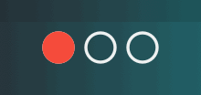
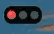
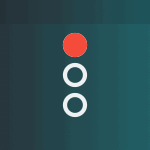
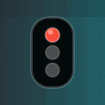
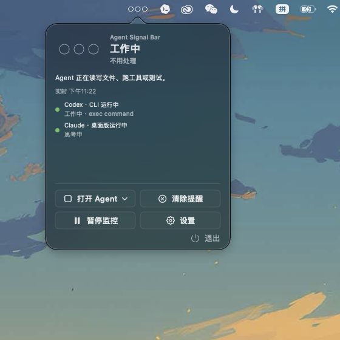
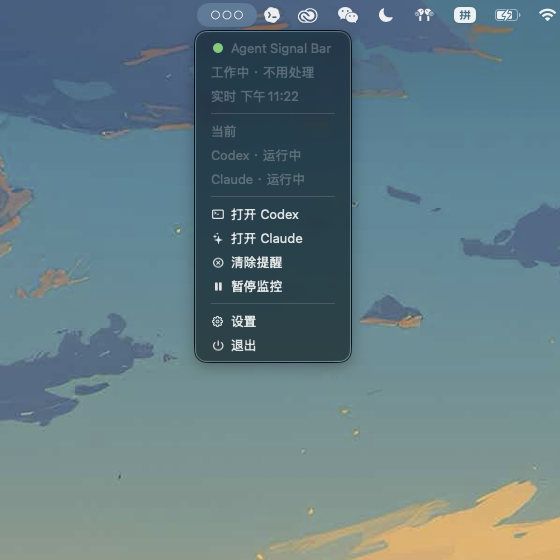
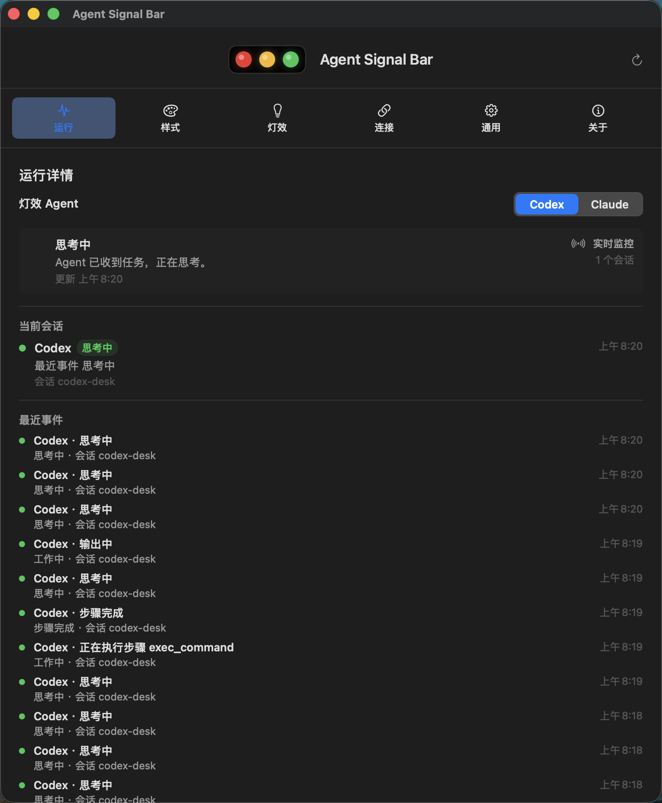
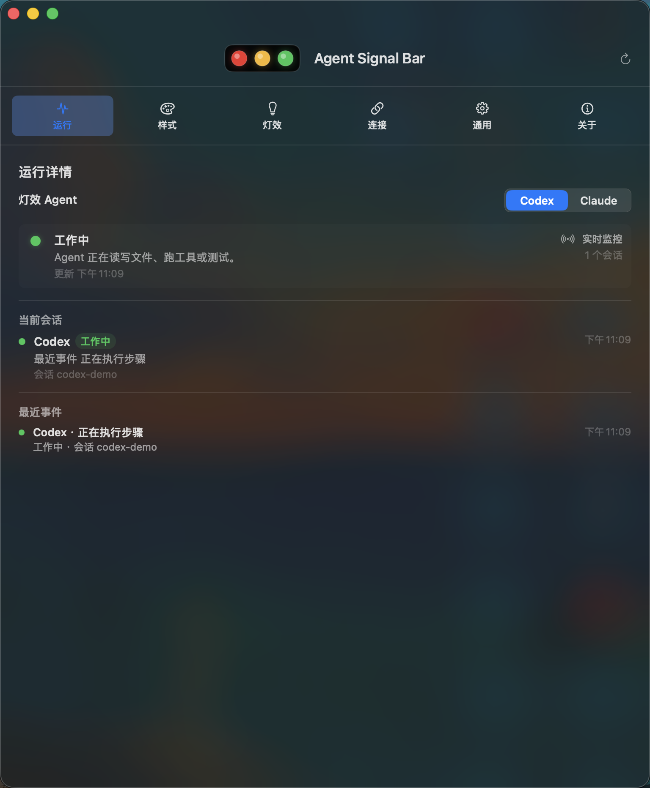
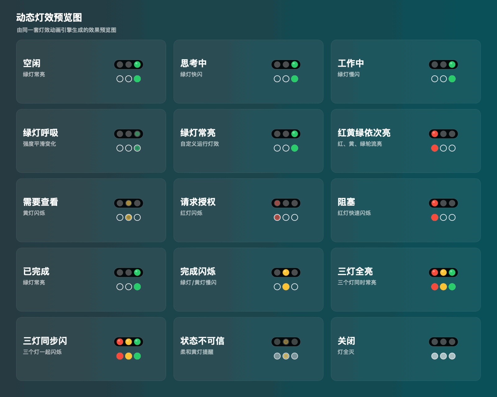

<h1 align="center">Agent Signal Bar</h1>

<p align="center">
  <a href="README.md">English</a> | <a href="README.zh-CN.md">简体中文</a>
</p>

<p align="center">
  <strong>本地 AI Agent 的 macOS 状态栏信号灯。</strong>
</p>

<p align="center">
  灯效可自定义 · 支持多语言 · 本地优先 · Codex Desktop 自动监控 · 支持 Claude Code Hook
</p>

<p align="center">
  <a href="https://github.com/guan-ops/Agent-Signal-Bar/releases/latest"></a>
  
  
  <a href="https://github.com/guan-ops/Agent-Signal-Bar/releases/latest"></a>
  <a href="LICENSE"></a>
  <a href="https://agentsignalbar.app"></a>
</p>

<p align="center">
  <a href="https://agentsignalbar.app">
    
  </a>
</p>

<table width="100%">
  <tr>
    <td align="center" width="18%"><strong>布局</strong></td>
    <td align="center" width="41%"><strong>极简圆点</strong></td>
    <td align="center" width="41%"><strong>经典灯牌</strong></td>
  </tr>
  <tr>
    <td align="center"><strong>横向</strong></td>
    <td align="center"></td>
    <td align="center"></td>
  </tr>
  <tr>
    <td align="center"><strong>竖向</strong></td>
    <td align="center"></td>
    <td align="center"></td>
  </tr>
</table>

<p align="center">
  <em>所有风格都使用红、黄、绿依次亮灯效。</em>
</p>

Agent Signal Bar 是一个本地优先的 macOS 状态栏应用，用红、黄、绿三颗信号灯显示本机 AI Agent 的运行状态。它适合放在菜单栏常驻使用，让你不用切回终端或编辑器，也能快速判断 Codex、Claude Code 或本地脚本现在是否空闲、思考中、执行中、完成、需要授权或已经阻塞。

## 下载和打开

普通用户请从 [GitHub Releases](https://github.com/guan-ops/Agent-Signal-Bar/releases/latest) 下载 App，不要点绿色的 `Code` 按钮。`Code > Download ZIP` 下载的是源码包，里面不会直接出现可双击打开的 App 安装包。

1. 打开 [最新 Release](https://github.com/guan-ops/Agent-Signal-Bar/releases/latest)。
2. 下载 `AgentSignalLight-local.dmg`。
3. 打开 DMG，把 `AgentSignalLight.app` 拖到 `Applications`。
4. 从 `Applications` 打开 Agent Signal Bar。

如果 macOS 首次打开时提示无法验证开发者，这是因为当前包还没有公证。可以右键 App 选择 `打开`，或到 `系统设置 > 隐私与安全性 > 仍要打开`。

开发者也可以下载源码后运行 `./script/build_and_run.sh`。

## 状态栏小菜单

<table>
  <tr>
    <td align="center"><strong>复杂小菜单</strong></td>
    <td align="center"><strong>简约小菜单</strong></td>
  </tr>
  <tr>
    <td></td>
    <td></td>
  </tr>
</table>

点击状态栏信号灯后，可以打开复杂小菜单或简约原生风格小菜单。两种模式都会显示当前状态、正在运行的 Agent、最新活动，并提供打开 Agent、清除提醒、暂停监控、进入设置和退出应用等快捷操作。

## 设置窗口液态玻璃对比

<table>
  <tr>
    <td align="center"><strong>无液态玻璃</strong></td>
    <td align="center"><strong>默认液态玻璃</strong></td>
  </tr>
  <tr>
    <td></td>
    <td></td>
  </tr>
</table>

两张图都是当前运行页的真实截图。左图是普通纯色设置窗口，右图是默认 `标准` 液态玻璃效果，可以看到桌面背景参与到窗口材质里。液态玻璃效果默认开启，可在 `通用 > 液态玻璃效果` 中切换 `标准 / 增强` 两档强度。

## 主要功能

- macOS 状态栏红黄绿信号灯，支持横向和竖向显示。
- 两种外观：经典灯牌和极简圆点。
- 状态栏小菜单显示当前状态、正在运行的 Agent、最近一条事件、快捷操作和退出入口。
- 设置窗口包含运行、通用、连接、高级、关于五个页面。
- 支持无需手动 Hook 的 Codex Desktop 本地活动监控，也支持可选 Codex Hook、Claude Code Hook 和通用 JSON 事件接入。
- 支持多 session 聚合，不会让普通工作状态覆盖权限、失败或阻塞提醒。
- 支持本地 CLI：脚本、自动化和其他 Agent 都可以写入同一个状态文件。
- 支持多语言界面，可跟随系统语言，也可以手动切换。
- 支持灯效自定义，可调整闪烁速度、呼吸强度和不同状态的灯效。
- 支持主题切换和开机自启动。
- 不需要云服务，状态文件、Hook 和诊断都保存在本机。

## 灯语

| Agent 状态 | 默认灯效 | 含义 |
| --- | --- | --- |
| 空闲 `idle` | 绿灯常亮 | 没事，不用处理 |
| 思考中 `thinking` | 绿灯快闪 | Agent 正在理解任务 |
| 工作中 `working` | 绿灯慢闪 | 正在读写文件、运行工具或测试 |
| 步骤完成 `tool_done` | 绿灯慢闪 | 一个步骤完成，工作流仍可能继续 |
| 已完成 `done` | 绿灯常亮 | 任务完成，稍后自动回到空闲 |
| 需要查看 `attention` / `notification` | 黄灯闪烁 | 有空看一下 |
| 等待授权 `permission` / `permission_request` | 红灯闪烁 | 需要立即批准 |
| 阻塞或失败 `blocked` / `failure` / `error` | 红灯快速闪烁 | 需要立即处理 |
| 状态不可信 `stale` | 灰黄提示 | 状态文件过期、损坏或无法确认 |
| 关闭 `off` / `pause` | 灯全灭或灰色静止 | 暂停显示 |

灯效可以在设置窗口的「高级」页面里自定义。默认设置为：

- 思考灯效：绿灯快闪
- 工作灯效：绿灯慢闪
- 完成灯效：绿灯常亮

## 灯效预览图

<p align="center">
  
</p>

## 聚合优先级

当多个 Agent 或多个 session 同时存在时，状态栏只显示当前最高优先级状态：

```text
paused > blocked > permission > needs_review > stale > active > completed > ready
```

这意味着红灯状态永远不会被普通工作状态覆盖；黄色提醒也不会被新的执行状态冲掉。`done` 默认停留 90 秒后自动回到空闲，避免完成态长期占用状态栏。

## 快速开始

构建并运行：

```bash
./script/build_and_run.sh
```

验证 App 是否启动：

```bash
./script/build_and_run.sh --verify
```

打开设置窗口做 UI 验证：

```bash
./script/build_and_run.sh --ui-verify
```

运行本机诊断：

```bash
./script/doctor.sh
./script/doctor.sh --full
```

打包本地 App：

```bash
./script/package_app.sh --release
```

生成 zip 和 DMG：

```bash
./script/package_release.sh
```

## CLI 用法

安装 CLI：

```bash
./script/install_cli.sh
```

写入状态：

```bash
./scripts/agent-signal idle
./scripts/agent-signal thinking --session codex-main --agent codex
./scripts/agent-signal working --session codex-main --agent codex --event PreToolUse
./scripts/agent-signal permission --session claude-main --agent claude-code --event PermissionRequest
./scripts/agent-signal blocked --session job-1 --agent script --event Failed
./scripts/agent-signal done --session codex-main --agent codex --event Stop
```

查看当前状态：

```bash
./scripts/agent-signal status
./scripts/agent-signal status --json
```

清除提醒：

```bash
./scripts/agent-signal clear-warning
```

重置为空闲：

```bash
./scripts/agent-signal reset
```

把任意命令包装成 Agent 状态：

```bash
./scripts/agent-signal-run \
  --session nightly-build \
  --agent script \
  -- ./run-build.sh
```

## 接入 Agent

Codex Desktop 不需要手动安装 Hook 也可以使用。只要在 App 中保持「监控 Codex Desktop」开启，Agent Signal Bar 就会读取本机 Codex session 日志，自动识别思考中、工作中、步骤完成和完成状态。Hook 对 Codex Desktop 是可选项，但仍然适合 Codex CLI/TUI、Codex IDE 兼容、项目级自动化、Claude Code，以及其他会直接上报事件的本地 Agent。

Codex Desktop 活动来自本机 Codex session 日志。普通浏览器使用不会触发 Agent Signal Bar，除非它本身是某个正在执行工具的 Codex 任务的一部分。

接入验证状态：

- Codex 已经过实际测试验证，完整支持。
- Claude Code Hook 接入逻辑已实现，但尚未进行真实 Claude Code 工作流验证。

当你需要 CLI/IDE 或 Claude Code 接入时，可以安装 Hook：

```bash
./script/install_hooks.py --target all --codex-scope project --dry-run
./script/install_hooks.py --target all --codex-scope project --install
```

开发当前项目时建议使用 `--codex-scope project`，避免项目级和用户级 Codex Hook 同时触发。

通用 JSON 接入：

```bash
echo '{"event":"AgentStarted","agent":"local-script","session_id":"local-main"}' \
  | ./scripts/generic-agent-signal-hook

echo '{"event":"ApprovalRequired","agent":"local-script","session_id":"local-main"}' \
  | ./scripts/generic-agent-signal-hook
```

## 状态文件

默认状态文件：

```text
/tmp/agent-signal/status.json
```

示例：

```json
{
  "schema_version": 1,
  "aggregate": "working",
  "updated_at": "2026-05-28T03:45:00Z",
  "sessions": {
    "codex-main": {
      "agent": "codex",
      "signal": "working",
      "last_event": "PreToolUse",
      "updated_at": "2026-05-28T03:45:00Z"
    }
  },
  "events": [
    {
      "id": "D4204E0A-5B5D-4DFB-A3BC-643E6C7C6F8F",
      "session_id": "codex-main",
      "agent": "codex",
      "signal": "working",
      "event": "PreToolUse",
      "updated_at": "2026-05-28T03:45:00Z"
    }
  ]
}
```

可用环境变量：

```bash
export AGENT_SIGNAL_LIGHT_STATE_FILE=/path/to/status.json
export AGENT_SIGNAL_LIGHT_STATE_DIR=/tmp/agent-signal
export AGENT_SIGNAL_LIGHT_EVENT_LIMIT=30
export AGENT_SIGNAL_LIGHT_COMPLETED_TTL_SECONDS=90
export SIGNAL_LIGHT_SESSION_TTL_SECONDS=1800
```

## 项目结构

```text
Sources/
  AgentSignalLight/        macOS App、状态栏、设置窗口
  AgentSignalLightCore/    状态模型、聚合逻辑、Hook 映射
  AgentSignalLightUI/      红绿灯渲染和图标几何
  AgentSignalCLI/          agent-signal CLI
scripts/                   CLI wrapper 和 Hook wrapper
script/                    构建、安装、诊断、打包脚本
docs/                      接入文档、状态文件 schema、发布检查清单
Tests/                     Swift 测试
```

## 文档

- [灯语说明](docs/LAMP_LANGUAGE.md)
- [状态文件 schema](docs/STATE_SCHEMA.md)
- [Codex 接入](docs/CODEX_SETUP.md)
- [Claude Code 接入](docs/CLAUDE_CODE_SETUP.md)
- [本地脚本接入](docs/LOCAL_SCRIPT_SETUP.md)
- [GitHub 发布管理](docs/GITHUB_RELEASES.md)
- [发布检查清单](docs/RELEASE_CHECKLIST.md)
- [更新日志](CHANGELOG.md)

## 许可证

[MIT](LICENSE) • XiongYang Guan ([guan-ops](https://github.com/guan-ops))
